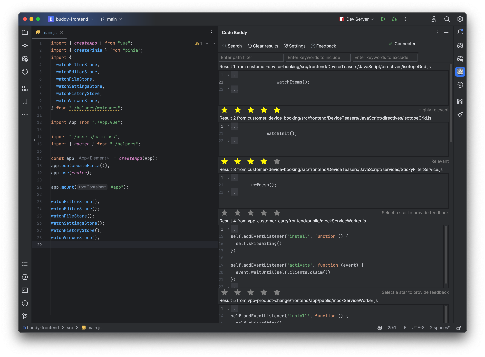

# copilot-toolwindow-plugin

## Plugin Description

Integrate any AI pair-programming API available on your local network into your Jetbrains IDEs. 
The plugin provides a tool window that can be accessed through the toolbar. 
It also provides a settings page that can be accessed through the settings menu or the toolbar. 
These settings include connection settings (host/port) and authentication settings (user/password) for the API. 

The plugin provides several actions: 
  * Searching for completions based on the active file and cursor position
  * Providing text feedback on the request
  * Providing feedback on the results using a simple star rating
  * Additionally there are some filter methods provided, which may be used in the request to the API

** You may need to adapt the plugin to your specific API. ** 

## Change Notes

<ul>
    <li><b>0.0.5</b> Introduced star rating for results</li>
    <li><b>0.0.4</b> Minor improvements and bug fixes</li>
    <li><b>0.0.3</b> Added feedback options, folding regions and user authentication</li>
    <li><b>0.0.2</b> Added a Tool Window anchored on the right side of your IDE</li>
    <li><b>0.0.1</b> Initial release of the plugin</li>
</ul>

## Installation
  
There are currently no releases provided. To install the plugin, you need to build it yourself and install it manually.

---
Plugin based on the [IntelliJ Platform Plugin Template][template].
As of January 2024, the plugin is no longer maintained by me.

[template]: https://github.com/JetBrains/intellij-platform-plugin-template

## Known Issues

- Folding regions are automatically expanded when the user closes and reopens the tool window
- Sometimes a disposal exception can occur when the user closes the application

## Resources

- https://plugins.jetbrains.com/docs/intellij/developing-plugins.html
- https://github.com/JetBrains/intellij-sdk-docs/tree/main/code_samples
- https://developerlife.com/2020/11/21/idea-plugin-example-intro/
- https://www.youtube.com/watch?v=IeqRswA9VP8
- https://www.baeldung.com/intellij-new-custom-plugin
- https://www.youtube.com/watch?v=F9UC9DY-vIU
- https://www.youtube.com/watch?v=cAwH_DbFrfw
- https://plugins.jetbrains.com/docs/intellij/tools-gradle-intellij-plugin.html#configuration-intellij-extension
